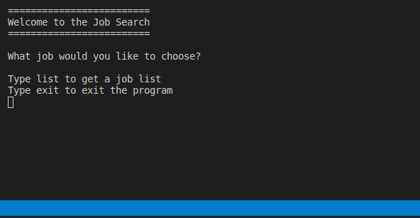

# Web-Scraper-Capstone
Welcome to the Web-Scraper. This is Microverse Cpastone project in Ruby. This projet scrpaes site https://weworkremotely.com/ and shows the job list in the terminal. It asks you the choose the job and shows you the link of that job. I chose that page because it will be useful for me in searching jobs.

## Built With

- Ruby

Gems:

HTTParty

Nokogiri

## Prerequisites

Ruby installed

### Setup
* Open your terminal and go to the directory where you want to clone the repo.

* Clone the repository to your local machine. Type $ git clone https://github.com/410AngelaVu/Web-Scraper-Capstone.git

* Go to the Web-Scraper-Capstone directory. Type $ cd Web-Scraper-Capstone

* Install the necessary gems to run the scraper. Type $ bundle install

* Now your environment is ready to run the scraper. Type $ ruby bin/main.rb

### How to run the RSpec test
You need to have the RSpec installed in you computer if you don't have it follow the steps.
Boot up your terminal and punch in gem install rspec to install RSpec. Once that’s done, you can verify your version of RSpec with rspec --version, which will output the current version of each of the packaged gems. Take a minute also to hit rspec --help and look through the various options available.

cd into the project and open a terminal.
In the terminal just write rspec to run the tests.

### Using the scraper
* When you run the scraper you will see welcome messageand it will ask you if you want to see a job list.

* If you want to see type 'list'

* You will get a list of remote jobs

* If you want to see company detail of specific job, enter the index

* After the search you can run again program by typing 'yes' or exit the program by typing 'exit'

## Author

👤 Andjela Vukadinovic 

- GitHub: [https://github.com/410AngelaVu]
- Twitter: [https://twitter.com/andjelavukadin7]
- LinkedIn: [https://www.linkedin.com/in/andjela-vukadinovic-67a21b1b2/]

## 🤝 Contributing

Contributions, issues, and feature requests are welcome!

Feel free to check the [issues page]().

## Show your support

Give a ⭐️ if you like this project!

## Acknowledgments

One of the Odin projects.
